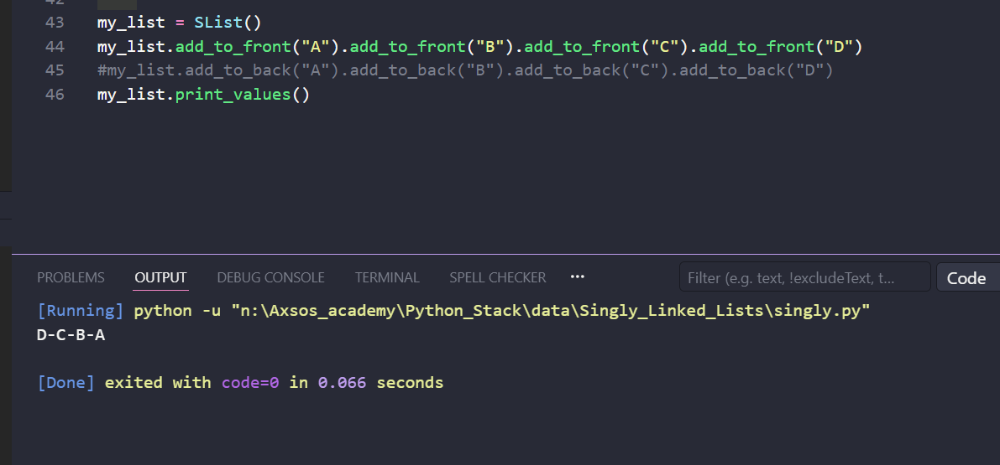
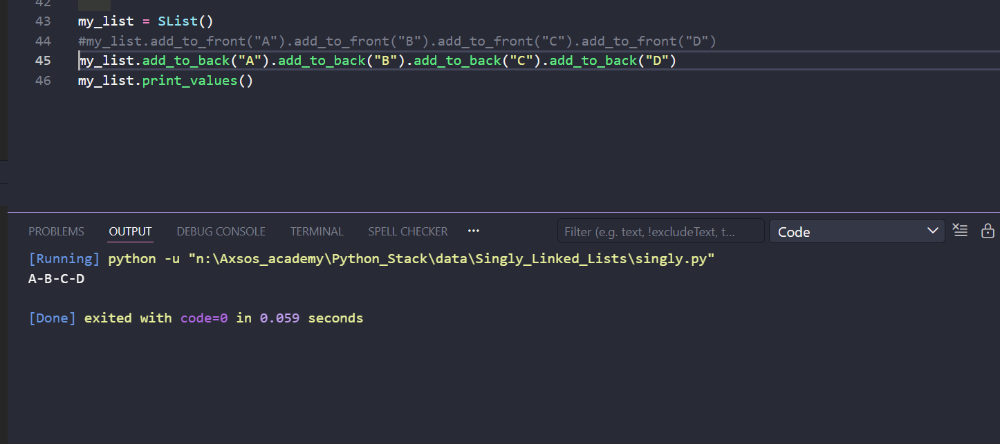

# Singly Linked List
This code implements a Singly Linked List. Unlike a standard array or Python list where elements sit next to each other in memory, a linked list stores data in independent blocks called Nodes. Each node holds a value and pointer to the next node in line using a reference called next.

## Classes
1. SLNose -> Represent a single node in the list

   - def __init__(self, val):
    self.value = val   
    self.next = None

2. SList -> Manage the linked list and exposes methods to manipulate it.

   - def __init__(self):
    self.head = None

## Methods 
1. SList.add_to_front(val)
    - Inserts a new node at the beginning of the list. Returns self for chaining.

2. SList.add_to_back(val)
    - Appends a new node at the end of the list. Returns self for chaining.

3. SList.print_values()
    - Traverses and prints all node values separated by '-'. Returns self.

## Example
1. Add to front 
    - 

2. Add to back
    - 