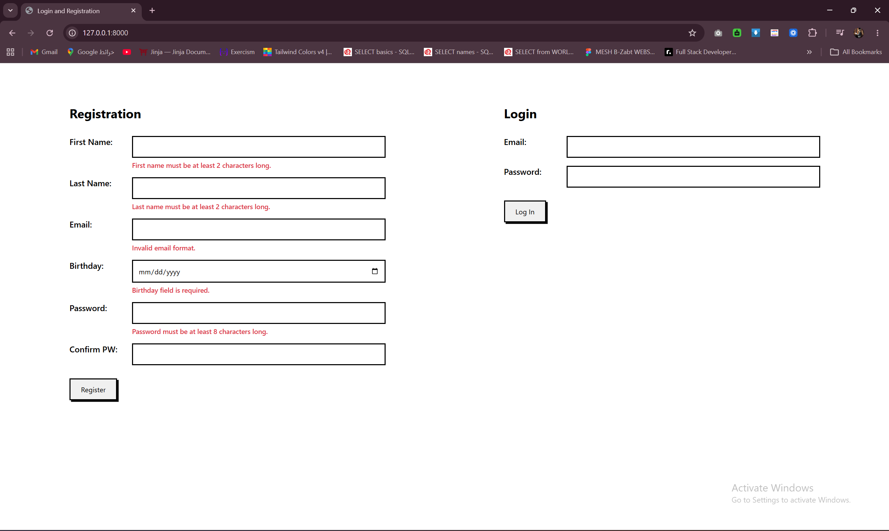
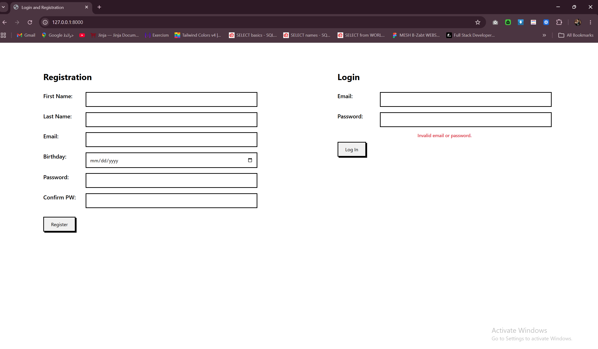
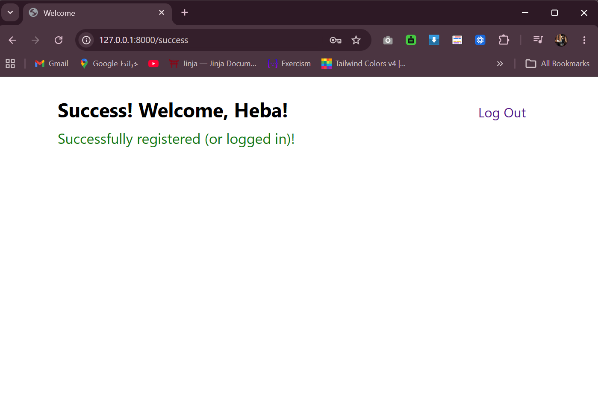

# Login and Registration
A Django project implementing a full login and registration system with validations, password hashing, flash messages, and session management.

<br>

## Features
    - Registration with full field validation and unique email check
    - Password hashing using bcrypt
    - Login with email/password verification
    - Flash error messages for invalid input
    - Session-based authentication
    - Protected `/success` route (redirects unauthenticated users to `/`)
    - Logout clears the session and redirects to the login/registration page

<br>

## How to Run
1. Activate the virtual environment:
    ```bash
    django_env\Scripts\activate (Windows)
    ```
2. Navigate into project 
    ```bash
    cd Registration_project
    ```
3. Run migrations
    ```bash
    python manage.py makemigrations
    python manage.py migrate
    ```
4. Run the server
    ```bash
    python manage.py runserver
    ```
5. Open your browser and go to 
    ```bash
     http://127.0.0.1:8000/
     ```

<br>

## Routes

| URL | Description |
|-----|--------------|
| `/` | Renders the registration and login forms |
| `/register` | Validates and registers a new user, starts a session, redirects to `/success` |
| `/login` | Validates credentials, starts a session, redirects to `/success` |
| `/success` | Displays a welcome message with the user's name (protected route) |
| `/logout` | Clears the session and redirects to `/` |

<br>

## Output


<br>



<br>

