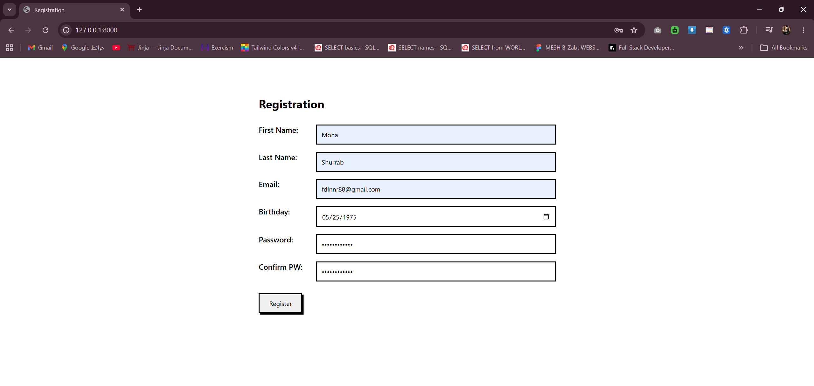
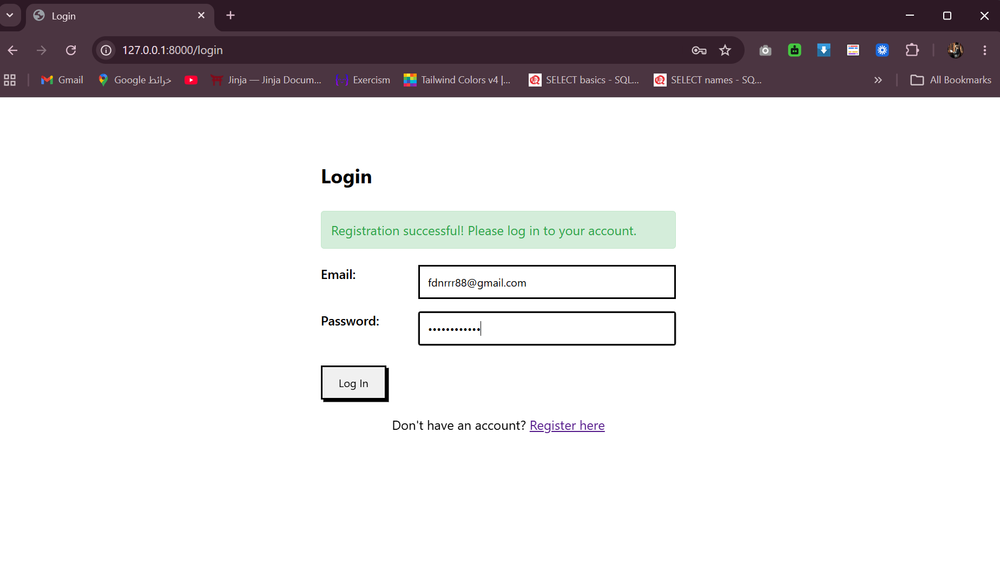
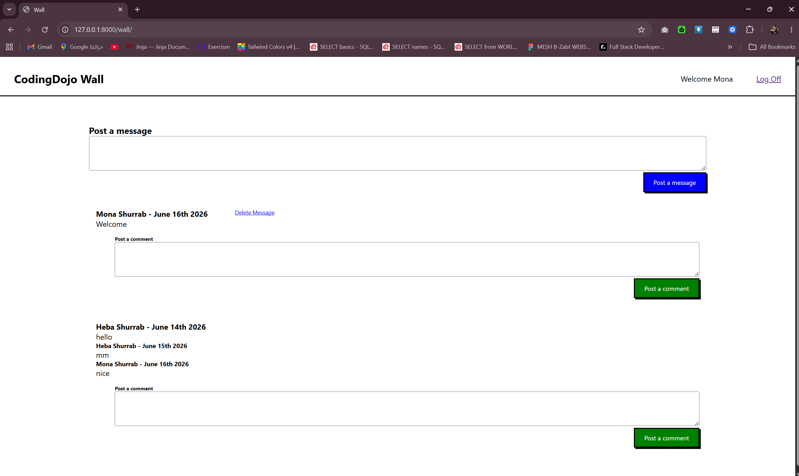

# The Wall
A Django web application that simulates a social wall (like a Facebook), where logged-in users can post messages and comments.

<br>

## ✅ Features
    - New Django project with login app and wall app
    - Models set up (User, Message, Comment)
    - Users can post messages
    - All messages displayed on the wall page (most recent first)
    - Users can comment on each message
    - All comments displayed per message (oldest first)
    - Users can delete only their own messages
    - Delete only allowed within 30 minutes of posting

<br>

## How to Run
1. Activate the virtual environment:
    ```bash
    django_env\Scripts\activate (Windows)
    ```
2. Navigate into project 
    ```bash
    cd Wall_project
    ```
3. Run migrations
    ```bash
    python manage.py makemigrations
    python manage.py migrate
    ```
4. Run the server
    ```bash
    python manage.py runserver
    ```
5. Open your browser and go to 
    ```bash
     http://127.0.0.1:8000/
     ```

<br>

## Routes
| URL | Description |
|-----|-------------|
| `/` | Login / Registration page |
| `/register` | Register new user |
| `/login` | Login user |
| `/wall` | Wall page — display all messages |
| `/wall/post_message` | Post a new message |
| `/wall/post_comment/<int:message_id>` | Post a comment on a message |
| `/wall/delete_message/<int:message_id>` | Delete a message (owner only) |
| `/logout` | Logout and redirect to login |

<br>

## Output


<br>



<br>



