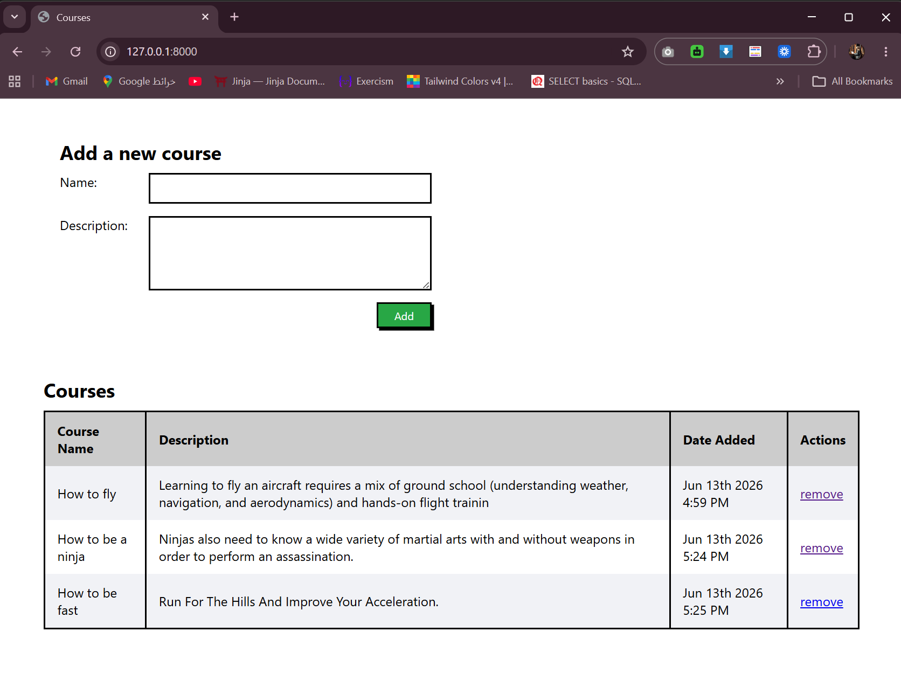
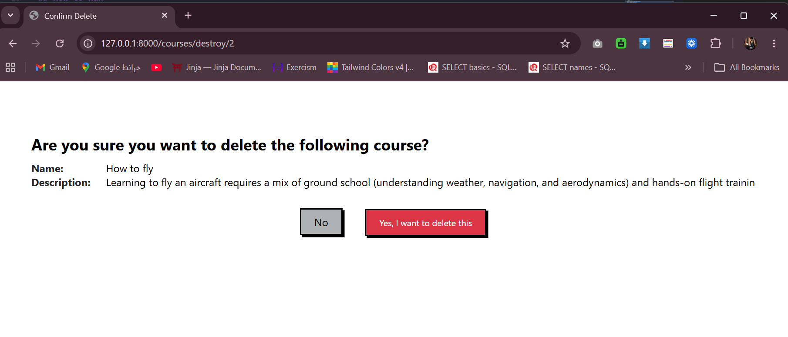

# Courses
A Django project for managing a list of bootcamp courses, with full create, read, and delete functionality plus model validation.

<br>

## Features
    - Add a new course with name and description
    - Display all courses in a table (Course Name, Description, Date Added, Actions)
    - Validate course name (> 5 characters) and description (> 15 characters)
    - Confirmation page before deleting a course
    - Delete a course only after explicit confirmation

<br>

## How to Run
1. Activate the virtual environment:
    ```bash
    django_env\Scripts\activate (Windows)
    ```
2. Navigate into project 
    ```bash
    cd courses
    ```
3. Run migrations
    ```bash
    python manage.py makemigrations
    python manage.py migrate
    ```
4. Run the server
    ```bash
    python manage.py runserver
    ```
5. Open your browser and go to 
    ```bash
     http://127.0.0.1:8000/
     ```

<br>

## Routes

| URL | Description |
|-----|--------------|
| `/` | Renders the main page with the add course form and the table of all courses |
| `/courses/create` | Validates and adds a new course to the database, then redirects to `/` |
| `/courses/destroy/<id>` | Displays a confirmation page asking whether to delete the course |
| `/courses/destroy/<id>` | If confirmed ("Yes"), deletes the course and redirects to `/`. If "No", redirects to `/` without deleting |

<br>

## Output 


<br>



