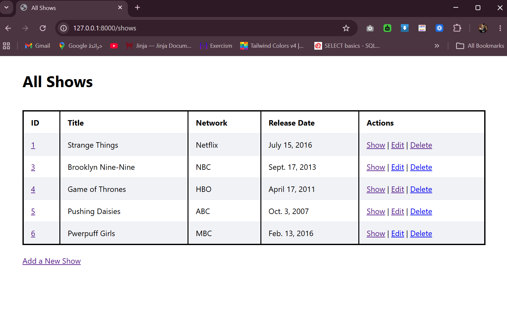
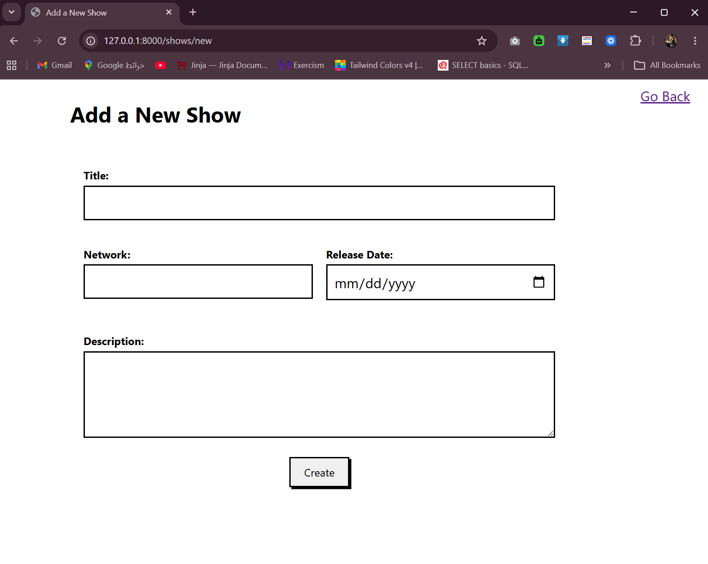
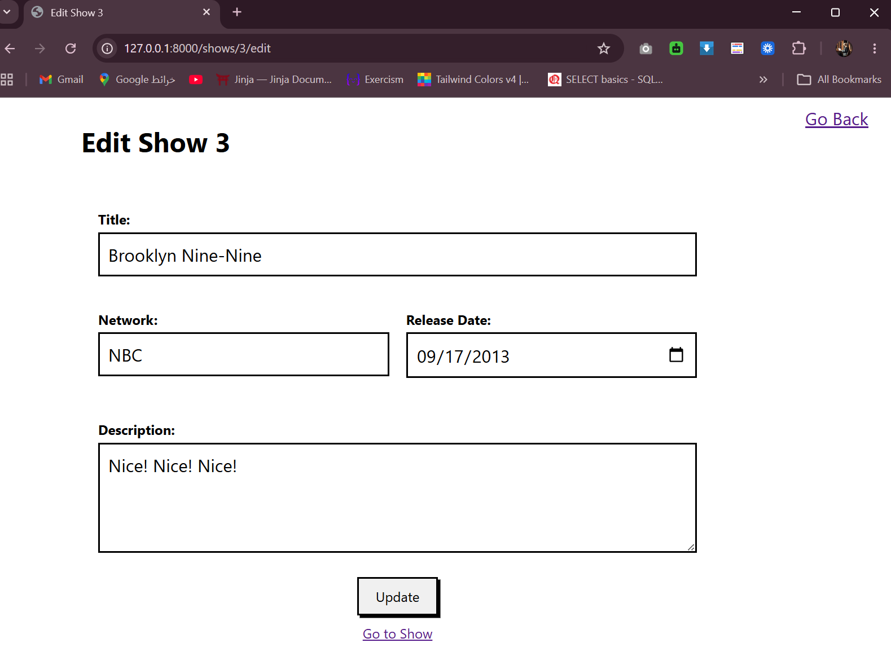
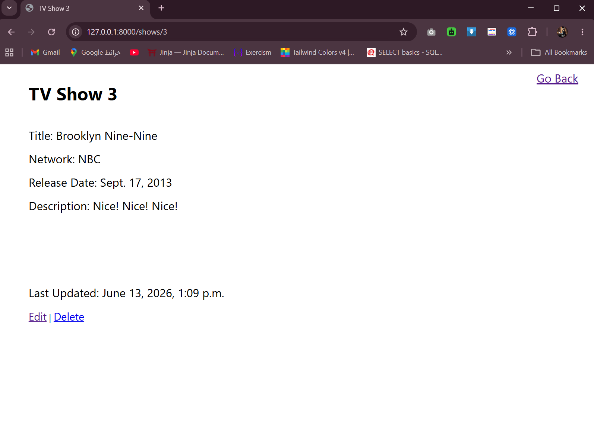
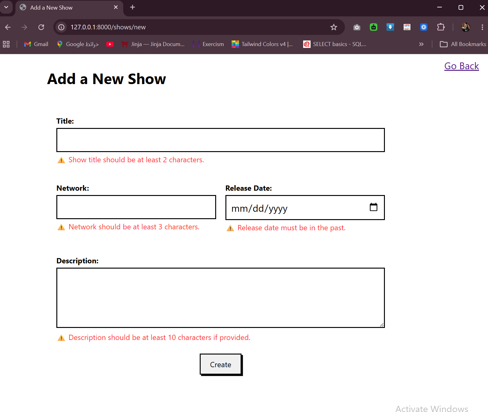
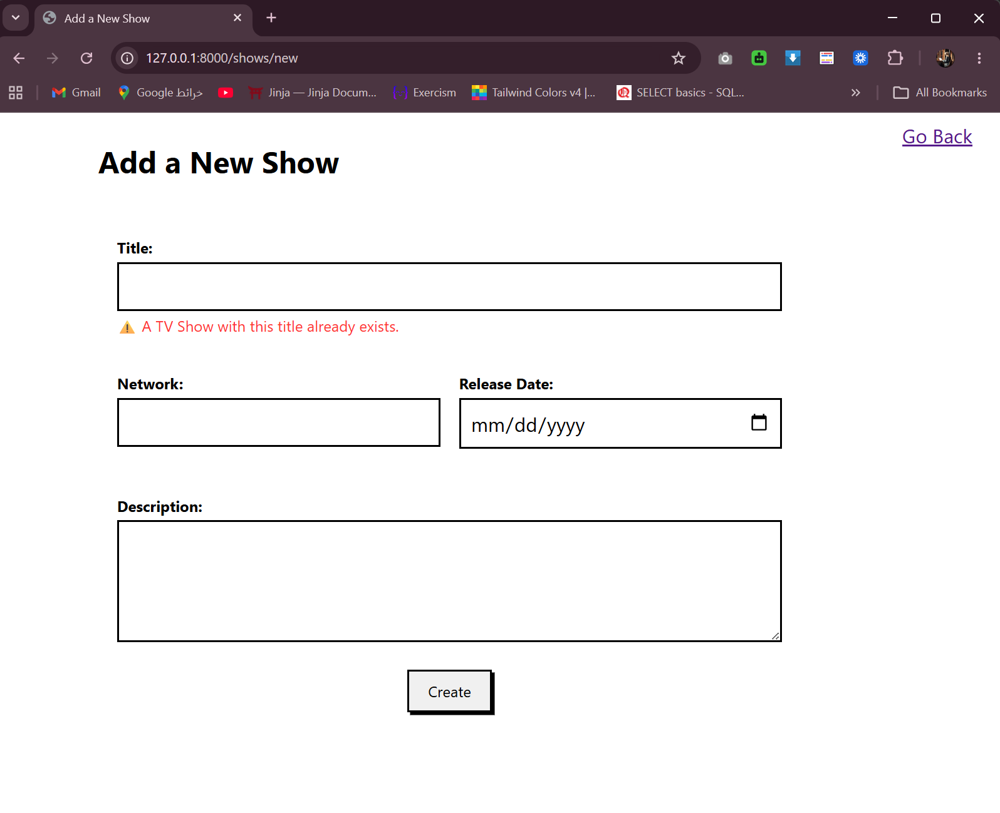

# Semi-Restful TV Shows
Demonstrating semi-RESTful routing conventions with full CRUD (Create, Read, Update, Delete) functionality for managing TV shows

<br>

## Features

    - Add new TV shows via a form
    - View all shows in a table with links to Show / Edit / Delete each entry
    - View details of a single show
    - Edit an existing show and redirect back to its detail page
    - Delete a show and redirect back to the shows list
    - Form Validation : Custom validation is implemented via a `ShowManager` on the `Show` model (`create_validator`), checking:
        - Title must be at least 2 characters
        - Network must be at least 3 characters
        - Description (if provided) must be at least 10 characters
        - Release date must be in the past
        - Title must be unique (excluding the current show when editing)
        - Validation errors are displayed using Django messages and redirect back to the form (`/shows/new` or `/shows/<id>/edit`) for correction.

<br>

## How to Run
1. Activate the virtual environment:
    ```bash
    django_env\Scripts\activate (Windows)
    ```
2. Navigate into project 
    ```bash
    cd semi_restful_tv_shows
    ```
3. Run migrations
    ```bash
    python manage.py makemigrations
    python manage.py migrate
    ```
4. Run the server
    ```bash
    python manage.py runserver
    ```
5. Open your browser and go to 
    ```bash
     http://127.0.0.1:8000/
     ```

<br>

## Routes 
| URL | Description |
|-----|--------------|
| `/shows/new` |  Renders a form for adding a new show |
| `/shows/create` | Adds the show to the database, then redirects to `/shows/<id>` |
| `/shows/<id>` | Displays a specific show's information |
| `/shows` | Displays all shows in a table |
| `/shows/<id>/edit` | Renders a form for editing the show with the given id |
| `/shows/<id>/update` | Updates the show in the database, then redirects to `/shows/<id>` |
| `/shows/<id>/destroy` | Deletes the show, then redirects to `/shows` |
| `/` | Redirects to `/shows` |

<br>

## Output


<br>



<br>



<br>



<br>



<br>

