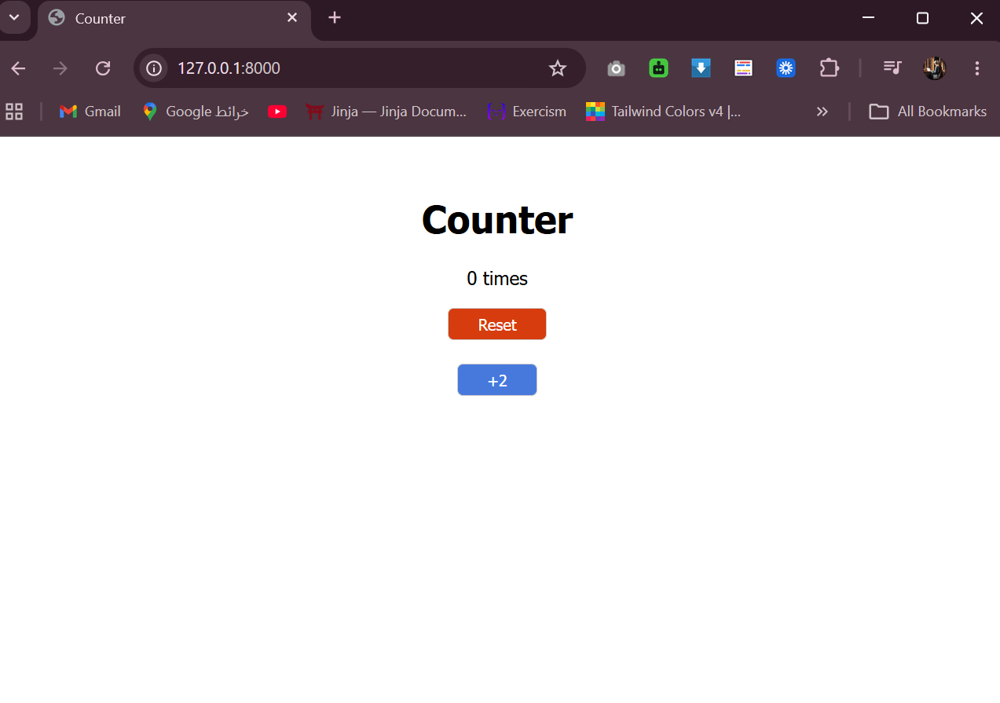
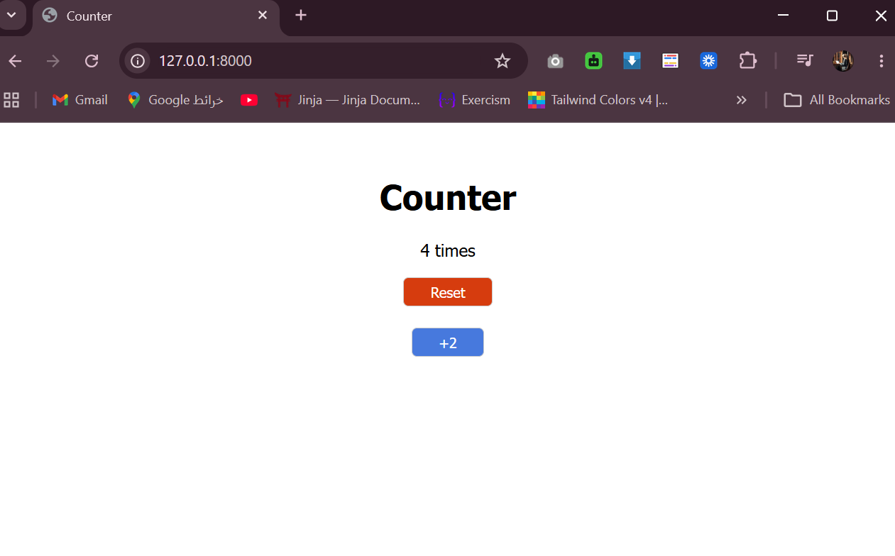
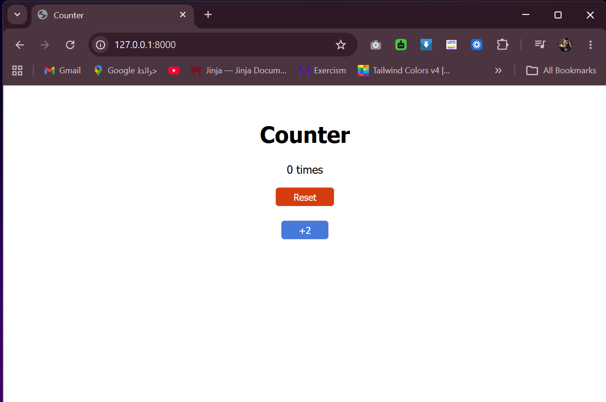
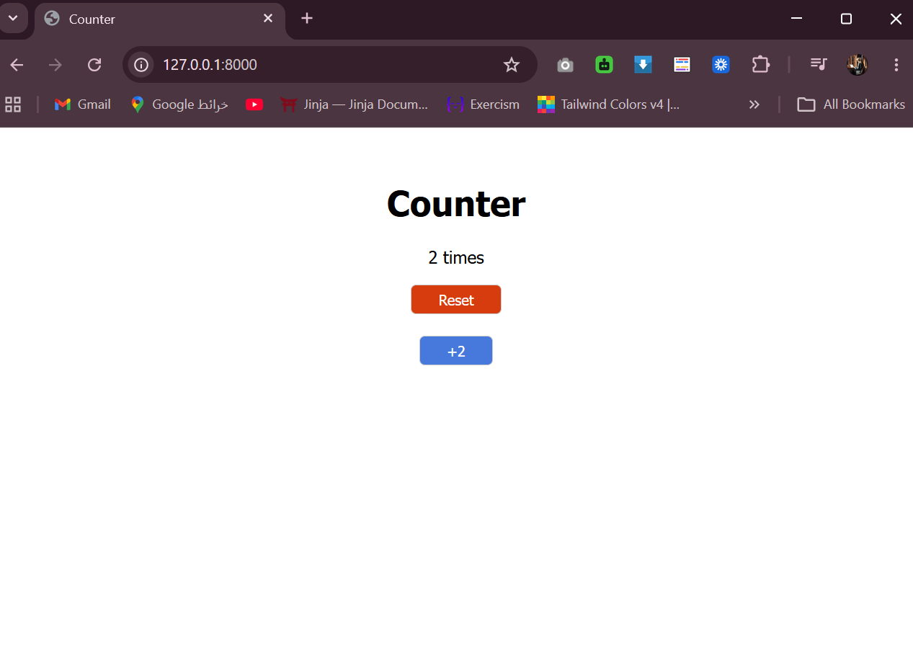

# Counter
Build a Django application that counts the number of times the root route / has been viewed.


## How to Run
1. Activate the virtual environment:
    - django_env\Scripts\activate (Windows)

1. Create Django project
    - django-admin startproject counter

2. Navigate into project
    - cd counter

3. Create app
    - python manage.py startapp counter_app

4. Run migrations
    - python manage.py makemigrations
    - python manage.py migrate

5. Run the server:
python manage.py runserver


## Required Routes

| Route | Description |
|-------|-------------|
| `localhost:8000/` | Render a template that displays the number of times the client has visited |
| `localhost:8000/destroy_session` | Clear the session and redirect to root |
| `localhost:8000/increment_two` | Increment the counter by 2 and redirect to root |


## Technologies Used
```dash
Python
Django
HTML / CSS
DTL (Django Template Language)
``` 


## Output
***first time to visit site***


***Refresh page and the counter increment***


***Click on reset button that clear session***


***Click on +2 button and the counter increment by 2***
