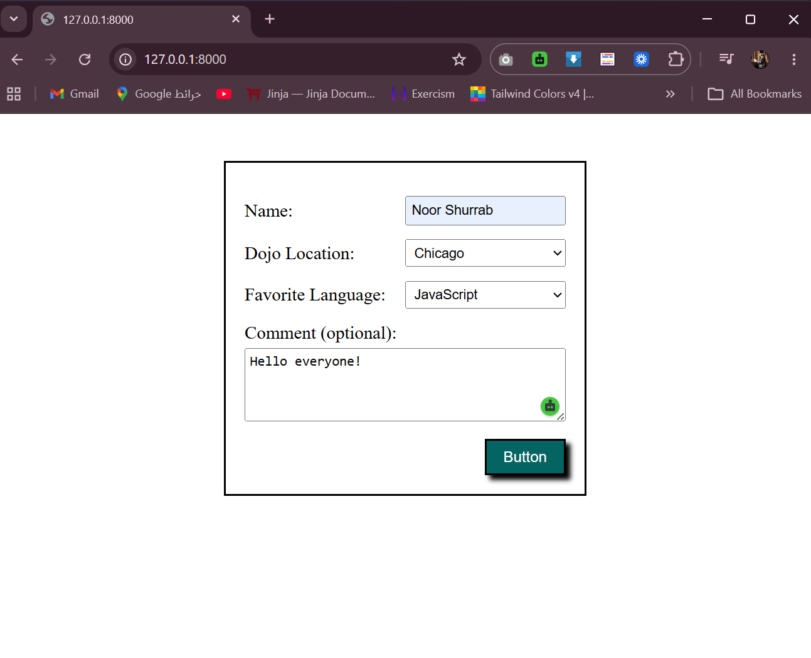
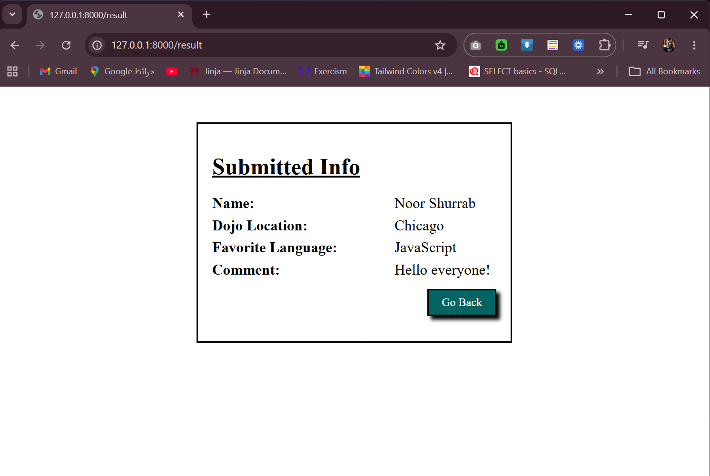

# Dojo Survey
A simple Django web application that accepts a form submission and displays the submitted data on a results page.

## How to Run
1. Activate the virtual environment:
    - django_env\Scripts\activate  (Windows)

2. Install Django:
    - pip install django

3. Run the server:
    - python manage.py runserver

4. Open your browser and go to:
    - http://localhost:8000

## Technologies Used
    Python
    Django
    HTML / CSS
    DTL (Django Template Language)

## Routes

| URL | Method | View | Description |
|-----|--------|------|-------------|
| `/` | GET | `index` | Displays the survey form |
| `/result` | POST | `result` | Displays submitted form data |

## Output

