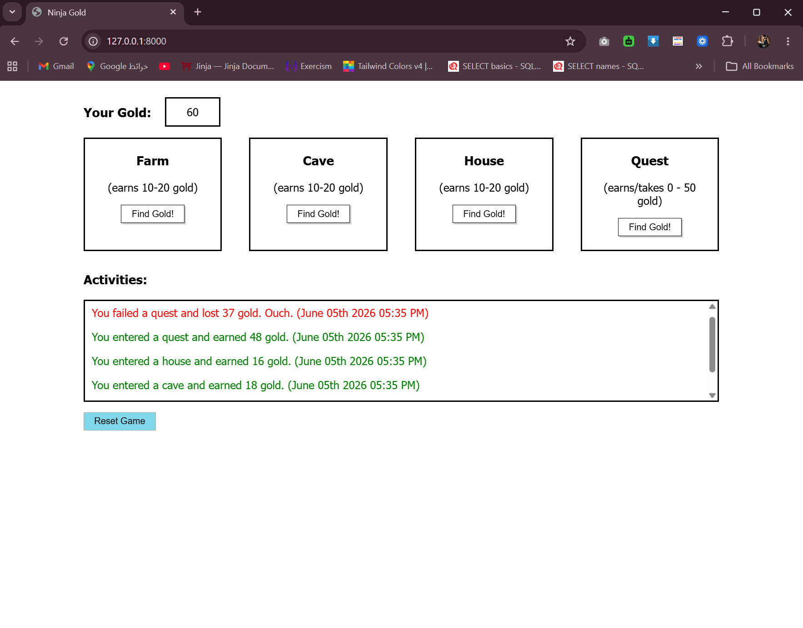

# Ninja Gold
A Django mini-game where a ninja earns (or loses) gold by visiting different locations. 

## How It Works
    - The ninja starts with 0 gold.
    - The player clicks "Find Gold!" on any location to earn gold.
    - Each action is logged in the **Activities** list with a timestamp.
    - Gold earned is shown in green, gold lost is shown in red.
    - A **Reset** button clears all session data and starts over.

## How to Run
1. Activate the virtual environment:
    - django_env\Scripts\activate (Windows)

2. Create Django project
    - django-admin startproject ninja_gold

3.Navigate into project
    - cd ninja_gold

4. Create app
    - python manage.py startapp gold_app

5. Run migrations
    - python manage.py makemigrations
    - python manage.py migrate

6. Run the server:
    - python manage.py runserver

## Routes
| View | URL |  Description |
|------|-----|-------------|
| `index` | `/` |  Renders the game page; initializes session on first visit |
| `process_money` | `/process_money/` | Calculates gold earned/lost and logs the activity |
| `reset` | `/reset/` |  Flushes the session and restarts the game |

---

## Output

