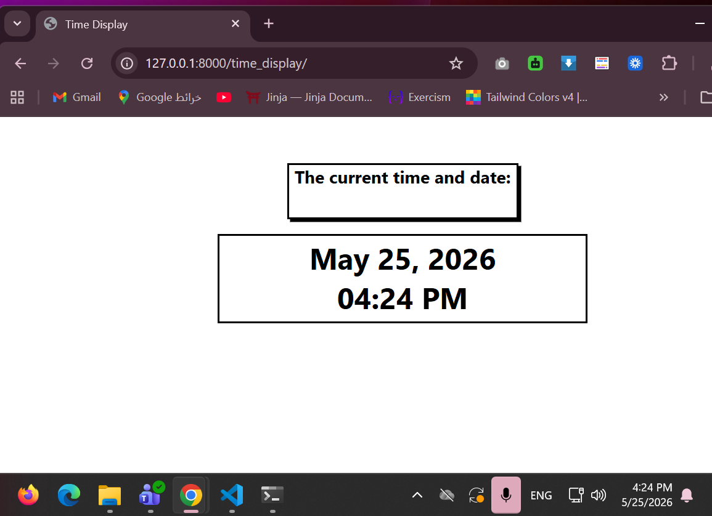

# Time Display
## How It Works
Visit `localhost:8000` or `localhost:8000/time_display` to see the current date and time rendered in a template.

## Key Files
| File | Purpose |
|------|---------|
| `views.py` | Gets current time using `datetime.now()` and passes it to the template |
| `index.html` | Displays the formatted date and time |
| `static/style.css` | Custom stylesheet |

## Routes
| URL | View | Description |
|-----|------|-------------|
| `/` or `/time_display` | `index` | Displays current date and time |

## Example Output
