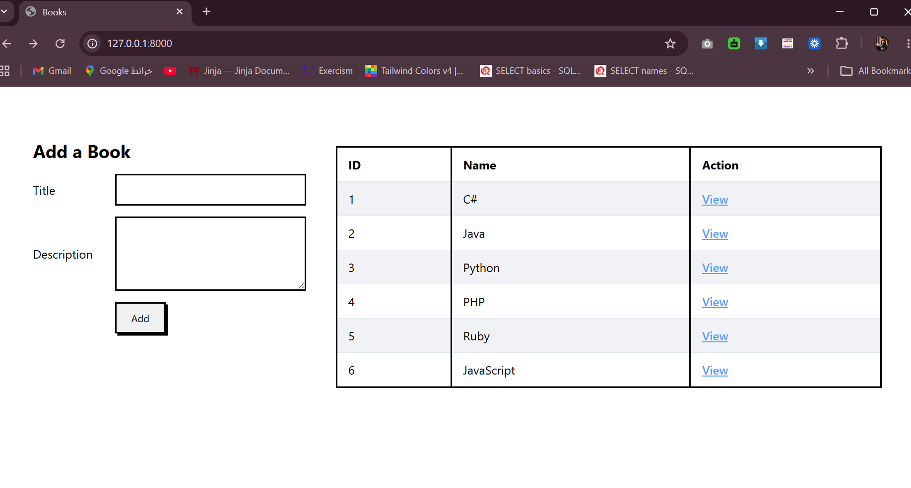
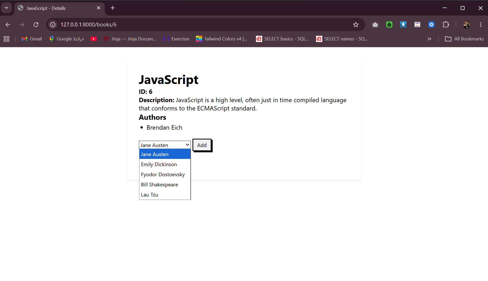
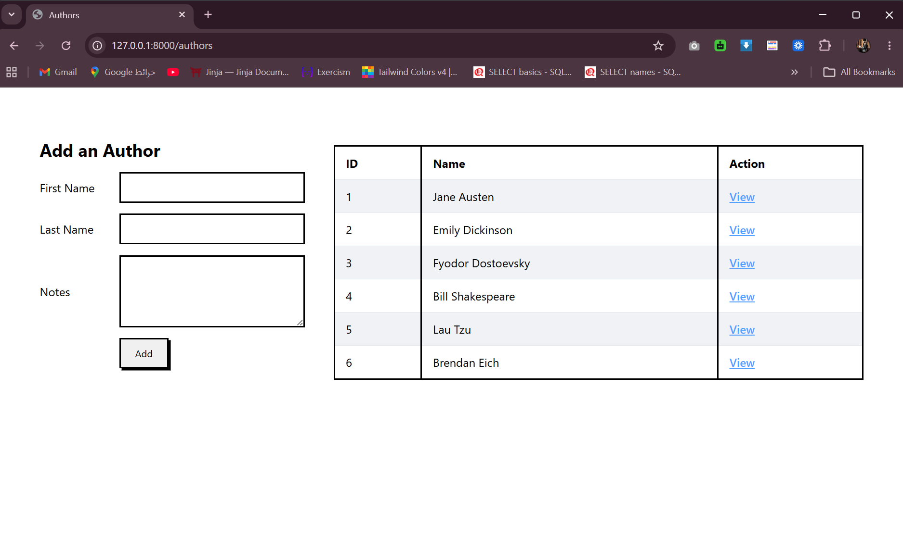
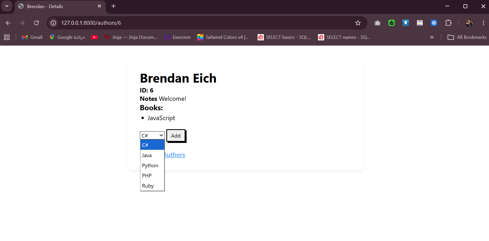

# Books & Authors with Templates
An application that manages Books and Authors using a **many-to-many relationship**.

<br>

## Features

- **Add a Book** — Form with Title and Description fields; also displays a table of all books
- **Add an Author** — Form with First Name, Last Name, and Notes fields also displays a table of all authors
- **Book Detail Page** — Shows book info + all associated authors, with a dropdown to add more authors
- **Author Detail Page** — Shows author info + all associated books, with a dropdown to add more books
- **Many-to-Many Association** — Books and Authors can be linked to each other from either side
- **SENSEI BONUS** — Dropdowns only show authors/books not yet associated with the given book/author


<br>


## How to Run
1. Activate the virtual environment:
    ```bash
    django_env\Scripts\activate (Windows)
    ```
2. Navigate into project 
    ```bash
    cd dojo_ninjas_proj
    ```
3. Run migrations
    ```bash
    python manage.py makemigrations
    python manage.py migrate
    ```
4. Run the server
    ```bash
    python manage.py runserver
    ```
5. Open your browser and go to 
    ```bash
     http://127.0.0.1:8000/
     ```


<br>

## Routes
| Route                        | Description                                        |
|------------------------------|----------------------------------------------------|
| `/` | Renders the index page with all books (`Book.html`) |
| `/books/add` | Creates a new book and redirects to index |
| `/books/<int:book_id>` | Displays a specific book with its associated authors (`View_book.html`) |
| `/books/<int:book_id>/add_author` | Adds an author to a specific book |
| `/authors` | Renders the index page with all authors (`Author.html`) |
| `/authors/add` | Creates a new author and redirects to authors index |
| `/authors/<int:author_id>` | Displays a specific author with their associated books (`View_author.html`) |
| `/authors/<int:author_id>/add_book` | Adds a book to a specific author |

---

<br>

## Output


<br>



<br>



<br>

