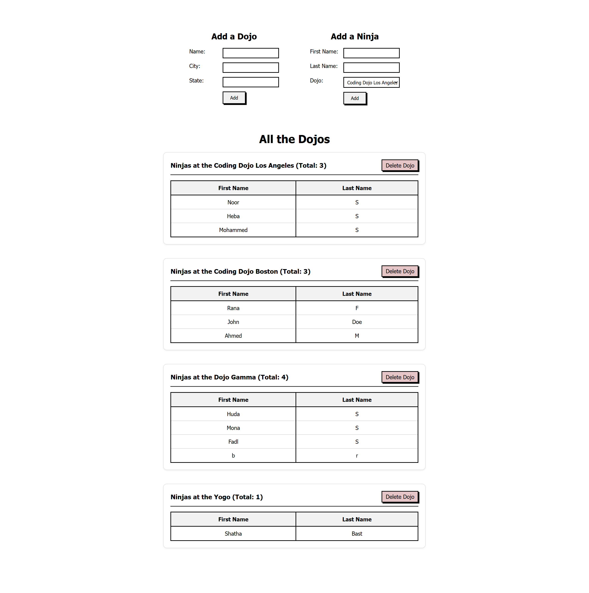

# Dojos & Ninjas with Template
An application that manages Dojos and their associated Ninjas using a one-to-many relationship.


## Features
- **Add a Dojo** — Form with Name, City, and State fields
- **Add a Ninja** — Form with First Name, Last Name, and a dropdown of all existing Dojos
- **View All Dojos** — Displays all dojos with their associated ninjas
- **Delete a Dojo** — Removes a dojo and all its ninjas from the database 
- **Ninja Count** — Shows the count of ninjas per dojo (e.g. *Ninjas at the Painting Dojo - 2*)


## How to Run
1. Activate the virtual environment:
    ```bash
    django_env\Scripts\activate (Windows)
    ```
2. Navigate into project 
    ```bash
    cd dojo_ninjas_proj
    ```
3. Run migrations
    ```bash
    python manage.py makemigrations
    python manage.py migrate
    ```
4. Run the server
    ```bash
    python manage.py runserver
    ```
5. Open your browser and go to 
    ```bash
     http://127.0.0.1:8000/
    ```


## Routes
| Route              | Description                                       |
|--------------------|---------------------------------------------------|
| `/`                | Renders the main template with all dojos & ninjas |
| `/dojo/create`     | Processes creation of a new dojo                  |
| `/ninja/create`    | Processes creation of a new ninja (with dojo dropdown) |
| `/dojo/delete/:id` | Deletes a dojo and all its associated ninjas      |

---

## Output
