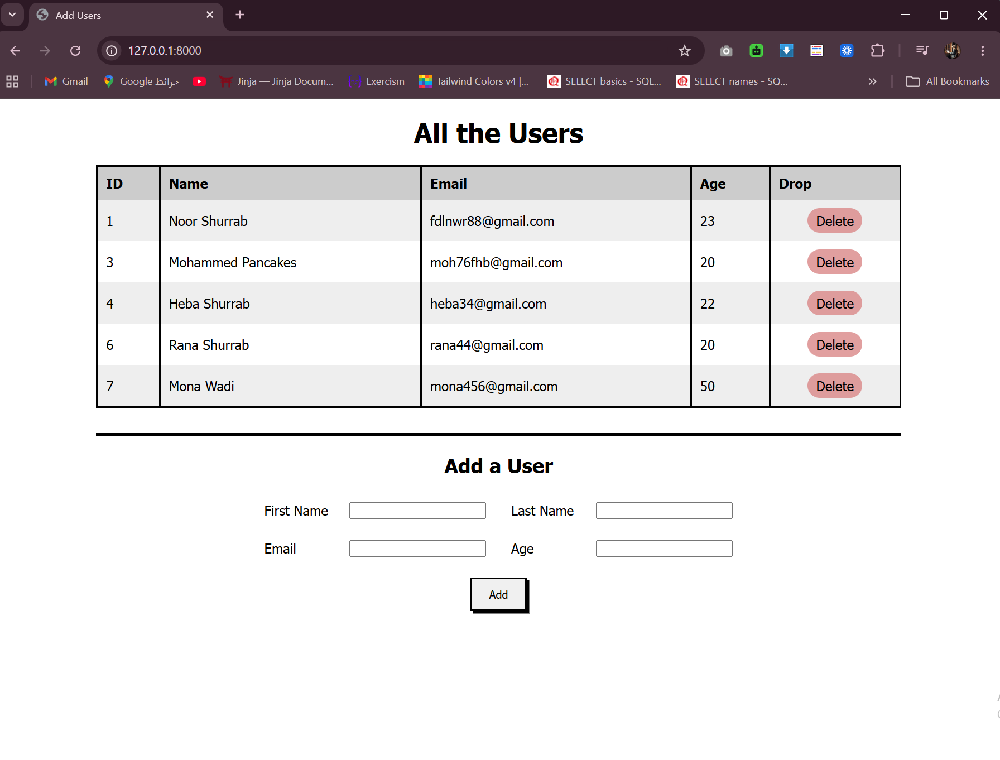

# Users with Templates
A Django web application that demonstrates the full **MTV (Model–Template–View)** architecture by managing a User database with a rendered HTML interface.


## Features
    - Display all users from the database in a styled table
    - Add new users via an HTML form
    - Delete users by ID
    - Full redirect flow after create/delete actions

## How to Run
1. Activate the virtual environment:
    ```bash
    django_env\Scripts\activate (Windows)
    ```
2. Navigate into project 
    ```bash
    cd single_model_orm
    ```
3. Run migrations
    ```bash
    python manage.py makemigrations
    python manage.py migrate
    ```
4. Run the server
    ```bash
    python manage.py runserver
    ```
5. Open your browser and go to 
    ```bash
     http://127.0.0.1:8000/
    ```

## Routes
| URL                  | View Function  | Description                        |
|----------------------|----------------|------------------------------------|
| `/`                  | `index`        | Renders all users in a table       |
| `/create`            | `create_user`  | Saves a new user, redirects to `/` |
| `/delete/<user_id>`  | `delete_user`  | Deletes a user by ID, redirects to `/` |

---

## Output

